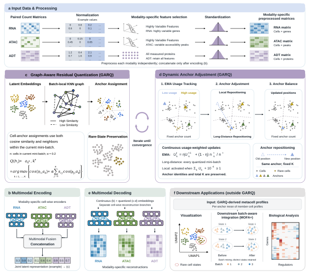

# GARQ

Graph-Aware Residual Quantization model (GARQ v1.0)

GARQ constructs metacell representations from single-cell data using modality-specific encoding, graph-aware assignment and usage-dependent anchor repositioning. The study evaluates metacell construction and downstream analyses on RNA+ADT, RNA+ATAC and RNA+ATAC+ADT datasets.

## Table of contents

- [Framework diagram](#framework-diagram)
- [Datasets](#datasets)
- [Dependencies](#dependencies)
- [Usage](#usage)
- [Output](#output)
- [Implementation notes](#implementation-notes)

## Framework diagram



Modalities are preprocessed separately and concatenated after cell-wise encoding. Assignment uses a batch-local graph; EMA updates reposition existing anchors. Aggregated profiles enter downstream analyses such as MOFA+. The matching vector PDF is [frame.pdf](frame.pdf).

## Datasets

Example datasets used in the article are available at [Figshare](https://doi.org/10.6084/m9.figshare.32751672). Place downloaded input files in a `datasets` folder or pass their paths to the script.

## Dependencies

The archived environment records Python 3.11.6, PyTorch 2.1.1, PyTorch Geometric 2.6.1, Scanpy 1.9.6, SciPy 1.11.3, scikit-learn 1.1.3, NumPy 1.26.0 and pandas 2.3.2. See `requirement.ymal` for the full historical Linux environment. Its CUDA-specific packages and host-specific prefix may need adjustment on another machine; it is an environment record, not a tested portable installer.

The model experiments used an NVIDIA RTX 4090 GPU with 24 GB device memory. Host-memory and timing measurements are described with their individual experiment settings.

## Usage

GARQ accepts a separate `.h5ad` count matrix for each modality, supporting RNA, ADT and ATAC inputs, including RNA+ADT, RNA+ATAC and RNA+ATAC+ADT combinations. Paired files must contain the same cells in the same row order. Cell-type labels are optional for construction and are used for annotation-based evaluation when supplied.

The original command-line entry point is `GARQ.py`. For example, from the repository root:

```bash
mkdir -p figures
python GARQ.py --data_file datasets/rna.h5ad datasets/adt.h5ad --data_type RNA ADT --save_name example --n_GARQs 500 --seed 1 --device cuda
```

Choose the anchor count and batch size for the dataset. At least one full training batch and enough initialization cells for the requested anchors are needed. Results are written to `save/`, and plots to `figures/`. See [GARQ_Tutorial.ipynb](GARQ_Tutorial.ipynb) for the original tutorial.

## Output

1. Modality-specific metacell mean profiles, computed from normalized, log-transformed member-cell profiles, for downstream analyses.
2. Cell-to-anchor assignments, which identify the cellular composition of occupied metacells.
3. Continuous cell embeddings in the assignment file for visualization and evaluation.

The original output writer does not retain all input cell/feature names or the occupied-anchor row mapping. The revision package supplies a separate metadata restoration tool; this does not change the numerical output.

## Implementation notes

[METHODS.md](METHODS.md) documents the implemented graph, EMA updates, decoder losses, batching and resource scope. This documentation and framework update preserves the original model computation. Revision experiment scripts are prepared separately; the original repository URL remains unchanged.
